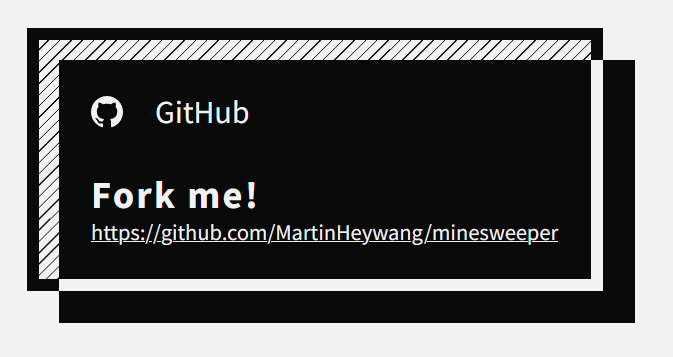

# A github "fork me" card

**I had the idea of a cool card and turned it into a "fork me"-like card.**
I want to challenge myself, making "complicated stuff" or at least uncommon/unseen things.

## Overview



## Build

This card is not published to GitHub Pages but in case you want to inspect it, you can:

```bash
# Clone the repo
gh repo clone MartinHeywang/stylised-github-card

# Serve the folder locally
# "npm i -g serve" if you haven't already installed serve.
cd stylised-github-card
serve -s .
```
